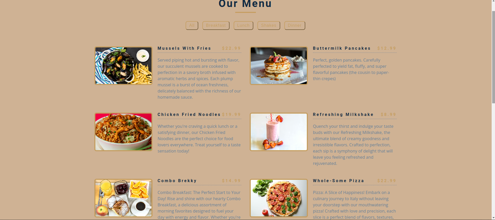

# Food Menu

## Project definition

> A food menu project in HTML, CSS, JavaScript a great way to practice
> Separation of Concerns. In this project, I create a food menu where users can
> view items and the prices.

## Table of contents

- [Food Menu](#food-menu)
  - [Project definition](#project-definition)
  - [Table of contents](#table-of-contents)
  - [General info](#general-info)
  - [Screenshots](#screenshots)
  - [Technologies](#technologies)
  - [Setup](#setup)
  - [Code Examples](#code-examples)
  - [Features](#features)
  - [Status](#status)

## General info

> The objective of the project is to practice separation of concern in
> JavaScript.

## Screenshots



## Technologies

- JavaScript
- HTML5
- CSS3
- VSC code
- Jest

## Setup

Create a new repo from the template

1. Clone the repo from your GitHub account
   > git clone `HTTPS link`
2. Open Visual Studio Code
3. Run npm i
4. Open index.html

## Code Examples

```js
const data = {
    menu: [
        {
            id: 0,
            title: 'Mussels with fries',
            category: 'dinner',
            price: 22.99,
            src: '../assets/item-0.jpg',
            desc: `Served piping hot and bursting with flavor, our succulent mussels are cooked to perfection in a savory broth infused with aromatic herbs and spices. Each plump mussel is a burst of ocean freshness, delicately balanced with the richness of our homemade sauce.`,
        },
 ],
```

## Features

- Display Menu Items: Show a list of food items along with their prices.
- Filtering: Allow users to filter the menu based on categories (e.g.,
  breakfast, lunch, dinner).
- Images: Include images of the food items to make the menu more visually
  appealing.
- Detailed Information: Provide additional details about each menu item, price,
  descriptions.

To-do list:

- Start by defining the HTML structure for the food menu.
- Style the menu using CSS.
- Separating concerns in this way, to have a clear structure, making code easier
  to understand, maintain, and expand upon. It's a great approach for building
  scalable and maintainable page

## Status

Project is: completed
